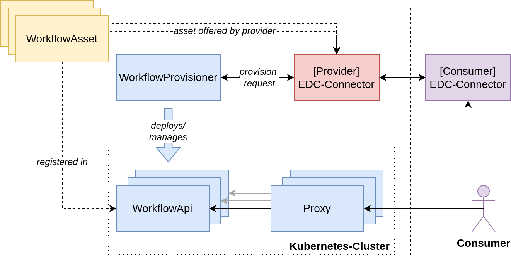
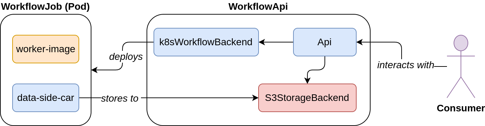

# Workflow Middle-Layer

This repository contains the documentation and images for the Middle-Layer components [Workflow-Api](https://github.com/reisman234/workflow-api) and [Workflow-Provisioner](https://github.com/reisman234/workflow-provisioner).

In combination with an [Eclipse Data Space Connector](https://github.com/eclipse-edc/Connector), both components allow an Compute Provider to offer his compute resources in form of WorkflowAssets. The WorkflowAsset defines currently a worker container, which is specified by a container image and the required hardware resources, and the input- and outputs-resources which the container needs and generates after the execution.

## [Workflow-Provisioner](https://github.com/reisman234/workflow-provisioner)

## [Workflow-Api](https://github.com/reisman234/workflow-api)

